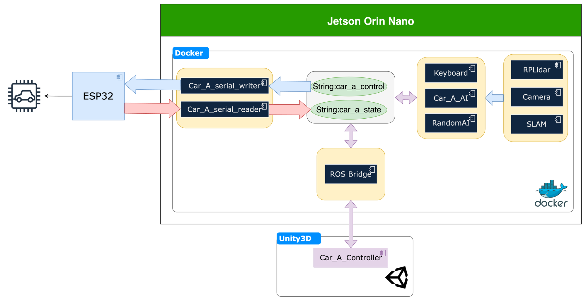

# PROS-Car

## Car Type

| Type                         | Description                                                |
| ---------------------------- | ---------------------------------------------------------- |
| ~~A~~                        | ~~Rear-wheel drive, front-wheel steering~~                 |
| ~~B~~                        | ~~Rear-wheel drive~~                                       |
| <font color=#0000FF>C</font> | Four-wheel drive <font color=#0000FF>with robot arm</font> |
| ~~D~~                        | ~~Mecanum wheel~~                                          |


## Workflow Diagram



## Deprecated Warning

The image in this repository `pros_car` is deprecated. Use `pros_ai_image` instead.

The Dockerfile here is to test new feature based on `ghcr.io/otischung/pros_ai_image:latest`.


## Feature

The docker image in this project has the following 4 features shown above.

- `Keyboard`
- `Car_<A,B,C,D>_serial_reader`
- `Car_<A,B,C,D>_serial_writer`
- `arm_reader`
- `arm_writer`


## The Link to the other Features

[pros_app](https://github.com/screamlab/pros_app) contains the following features.

- `RPLidar`
- `Camera`
- `SLAM`

[pros_AI](https://github.com/screamlab/pros_AI) contains `Car_B_AI`.

[pros_AI_image](https://github.com/otischung/pros_AI_image) is the repository which creates the entire base docker image.


# Get Started

## Run the Docker Image

We've written the `car_control.sh` shell script to run the image.


## Environment Variables

These environment variables are defined in `.env`.

### ROS Domain ID

You may change the ID number to divide other ROS environments.

```bash
export ROS_DOMAIN_ID=1
```


### Setting for the Speed of the Car

You can change the speed of your car via the Linux environment variable `WHEEL_SPEED` using the unit rad/s.

```bash
export WHEEL_SPEED=3
```


## ROS2 Services

### Code

- `Dockerfile`
  - You may change the ID number to divide other ROS environments.

```python
ENV ROS_DOMAIN_ID=1
```

- `Car<A~D>_serial_writer.py`
  - Send the signals to jetson orin nano, receive the signals from `Car<A~D>_keyboard.py`.
- `Car<A~D>_keyboard.py`
- Send the signal to `Car<A~D>_serial_writer.py`, in `target_vel`, index 0 is the left wheel, index 1 is the right wheel.
- If the car type is four-wheel drive, we have two lists, one contains `self._vel` and  `self._vel2` and the other contains `self._vel3` and `self._vel4`.

```python
# two wheels:
target_vel = [self._vel, self._vel]

# four wheels 
target_vel = [self._vel, self._vel2] 
target_vel = [self._vel3, self._vel4] 
# These two target velocities are sent through different topics
```

- `env.py`

  - When we set the USB port, if we run `Car<A~D>_serial_writer.py` and the terminal shows that “cannot find the desired USB port”, then you have to edit this script or check out the USB port on the car device.
  - You can run `ls /dev/ttyUSB*` to check your USB port number. 
    (if there doesn’t appear any USB devices, you must exit docker, and check the USB port on the car, `ttyUSB<0~3>` number depends on the inserted order)
  - We've defined <font color=#FF0000>the name of the soft link</font> for `usb_front_wheel`, `usb_rear_wheel`, and `usb_lidar` in [pros_app](https://github.com/otischung/pros_app). You may also use these rules in this container.
  - [Referene](https://inegm.medium.com/persistent-names-for-usb-serial-devices-in-linux-dev-ttyusbx-dev-custom-name-fd49b5db9af1)

- `car_models.py`

  - For all received data-class types, which the behavior is like `struct` in `C/C++`.

- Run the car (open two terminals)

  - Use `w a s d` or other keys to control the car.
  - Press `z` to stop the car.
    - Note: The car will always go forward and then stop slowly in any case. This is a bug in the C++ program controlling the ESP32.
  - Press `q` to exit the `keyboard.py`.

  ```python
  ros2 run pros_car_py car<A~D>_serial_writer.py
  ```

  ```python
  ros2 run pros_car_py car<A~D>_keyboard.py
  ```

